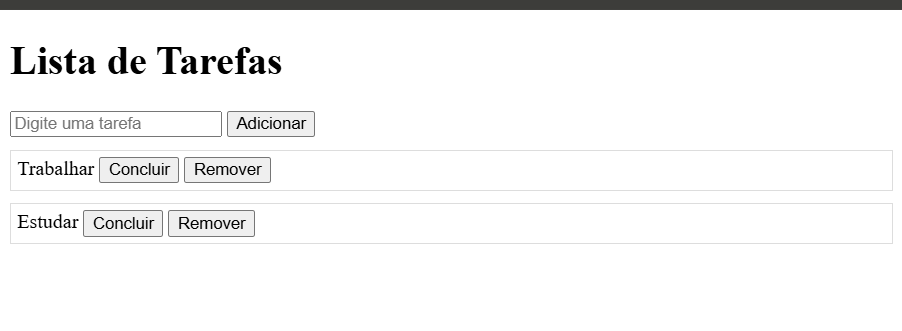

# Taskify - Lista de Tarefas

## Descrição
Este projeto é uma aplicação simples de lista de tarefas (to-do list) feita com HTML, CSS e JavaScript. Ele permite:
- Adicionar novas tarefas.
- Marcar tarefas como concluídas.
- Remover tarefas.

## Estrutura do Projeto

### Arquivos:
- `index.html`
- `style.css`
- `script.js`

## Exemplo de Tela
 